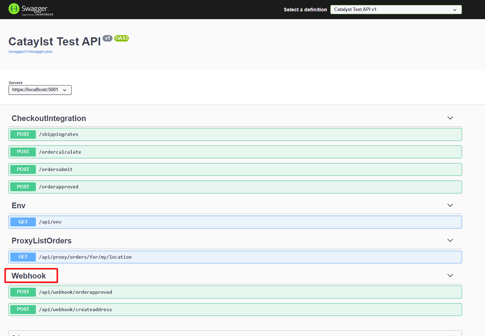
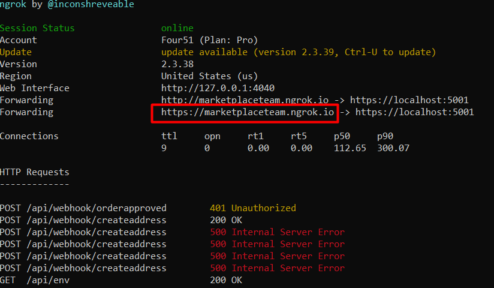
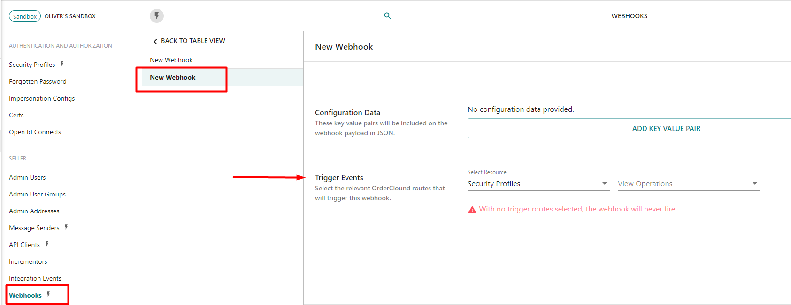

# Configure Webhook Event Listeners 

### What is this guide?

This guide will show you how to create your own http endpoints that perform custom logic in response to requests initiated by the OrderCloud platform. These requests can be triggered by any action in the platform and are called webhooks. Before beginning, read the guide ["Using Webhooks"](https://ordercloud.io/knowledge-base/using-webhooks) in the knowledge base to familiarize yourself with concepts. This guide will focus on step-by-step instructions and code examples to get you to the point where you know webhooks are working. 

### Get code and run API locally 

First, clone this github project into your local file system and consider setting up your own version control repository. Then, run the API project locally. To do this, follow instructions in [Start an API from scratch](./SetupApi.md). Stop before the section "Publish API to Azure App Service". When you run the API locally and navigate to https://localhost:5001 you should see route documentation, including two example webhook routes.    



Lets look at the code in [WebhookController.cs](https://github.com/ordercloud-api/dotnet-catalyst-examples/blob/dev/Catalyst.Api/Controllers/WebhookController.cs) that makes this happen.  

```c#
[HttpPost("api/webhook/createaddress")]
[OrderCloudWebhookAuth] 
public PreWebhookResponse Task HandleAddressCreate([FromBody] WebhookPayloads.Addresses.Create payload)
{
	....
}
```
`OrderCloudWebhookAuth` is a security feature that blocks requests that do not come from OrderCloud webhooks. The parameter type `WebhookPayloads.Addresses.Create` contains detailed info about a Create Address event in OrderCloud. The return type `PreWebhookResponse` lets us to block or allow the continuation of the create address logic in OrderCloud.

```c#
public virtual void ConfigureServices(IServiceCollection services) {
	services.AddOrderCloudWebhookAuth(opts => opts.HashKey = _settings.OrderCloudSettings.WebhookHashKey)
}
```
Set the app setting `WebhookHashKey` to a secret, arbitrary string. You will configure this string in OrderCloud to give webhooks access to your protected routes.  

### Using Ngrok for local development

When you are first setting up webhooks and later when you are developing the custom logic inside your routes, you'll want a better testing plan than publishing your changes to a hosted API and seeing if it works as expected. Seeing real OrderCloud webhook requests on a locally hosted API and stepping through the code with a debugger can be very helpful. The challenge is that you cannot simply provide OrderCloud with https://localhost:5001. The solution is a free tool called [Ngrok](https://ngrok.com/) that creates seccure tunnels from publically available urls to your middleware. 

[Install Ngrok](https://ngrok.com/download), start up your local API and in a terminal run `ngrok http https://localhost:5001 -host-header="localhost:5001"`. This more complicated command allows https connections as opposed to http. In the terminal window, ngrok will supply you with a public forwarding host. In postman or however you prefer make a GET request to https://{ngrok-host}/api/env. You should see a json response from your locally running middleware and a log of the request in ngrok. This is how you know ngrok is working. 



**Warning** - if you stop and restart the ngrok process, this url will change. A paid ngrok account will give you a dedicated url.

While Ngrok is running you can navigate to https://localhost:4040 for even more detailed logs, including http details and the ability to replay a request. If you place a debug breakpoint inside the function `GetEnvironment()` and replay the request to /api/env, your breakpoint will be hit.  

### Create Webhook configuration in OrderCloud

Now its time to configure OrderCloud to send webhook requests. Do this with the [create webhook](https://ordercloud.io/api-reference/seller/webhooks/create) API endpoint. The easiest way is probably through the [API Portal](https://portal.ordercloud.io/console). For the two example routes, the two webhook objects you should create are 

```jsonc
{
	"Name": "Create Address",
	"Description": "",
	"Url": "https://{ngrok-host}/api/webhook/createaddress", // using the ngrok-host provided by ngrok and the path from the code.
	"HashKey": "{WebhookHashKey}", // matches _settings.OrderCloudSettings.WebhookHashKey exactly
	"ElevatedRoles": null,
	"ConfigData": [],
	"BeforeProcessRequest": true, // makes it a pre-webhook
	"ApiClientIDs": [ .... ], // if unsure, assign to all ApiClientIDs
	"WebhookRoutes": [
		{
			"Route": "v1/buyers/{buyerID}/addresses",
			"Verb": "POST"
		}
	]
}

{
	"Name": "Order Approved",
	"Description": "",
	"Url": "https://{ngrok-host}/api/webhook/orderapproved", // using the ngrok-host provided by ngrok and the path from the code.
	"HashKey": "{WebhookHashKey}", // matches _settings.OrderCloudSettings.WebhookHashKey exactly
	"ElevatedRoles": null,
	"ConfigData": [],
	"BeforeProcessRequest": false, // makes it a post-webhook
	"ApiClientIDs": [], // if unsure, assign to all ApiClientIDs
	"WebhookRoutes": [
		{
			"Route": "v1/orders/{direction}/{orderID}/approve",
			"Verb": "POST"
		}
	]
}
```

Make sure you assign these webhook configs to ApiClientIDs. Requests made to the API with these ApiClientIDs will trigger webhooks. If your unsure, add all of them to the array.

To see a list of all available webhook triggers, create a webhook config through the API Portal.



You are now ready to trigger your first webhook. Place a break point in `HandleAddressCreate()`. Through the OrderCloud API, attempt to create a buyer address. **Warning** - if you're doing this through the API Portal, make sure you select a specific user context in the upper left hand corner. Requests in the API Portal without a specific user context are not assosiated with an ApiClientID so will not trigger webhooks. As you try to create the address, your local break point should be hit! Now you can develop your custom logic.   

For each additional webhook event you wish to listen to, create a route in your code and a matching webhook config.


### Publish Webhook Listeners

The final step is to deploy this logic. Continue the guide [Start an API from scratch](./SetupApi.md) to see steps for deploying your API. For webhooks, an important additional step is to update your configuration in OrderCloud. Make sure the `Url` property is changed from `https://{ngrok-host}/api/webhook/orderapproved` to `https://{my-hosted-site}/api/webhook/orderapproved`, for example. Do this for all your webhook configs. 

Congratuations, you have set up OrderCloud webhooks!
